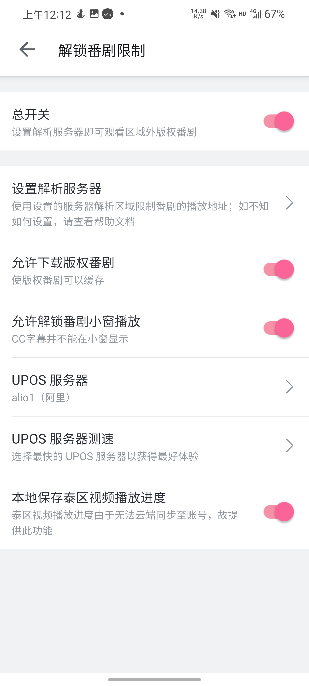
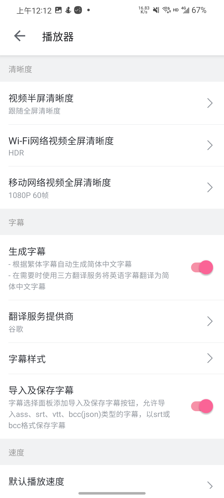
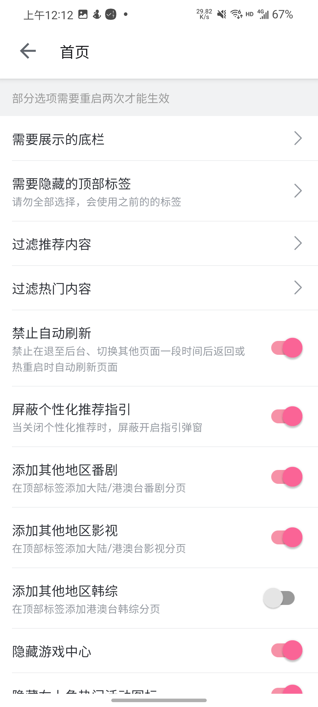
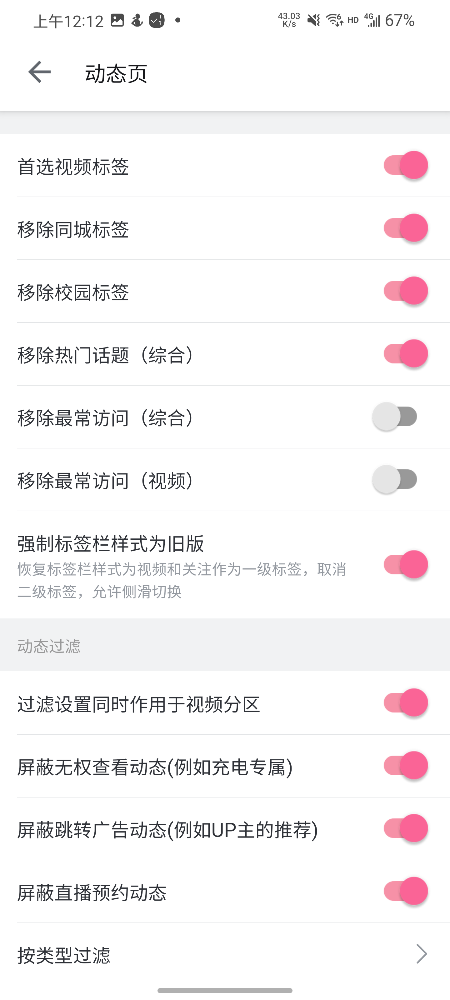
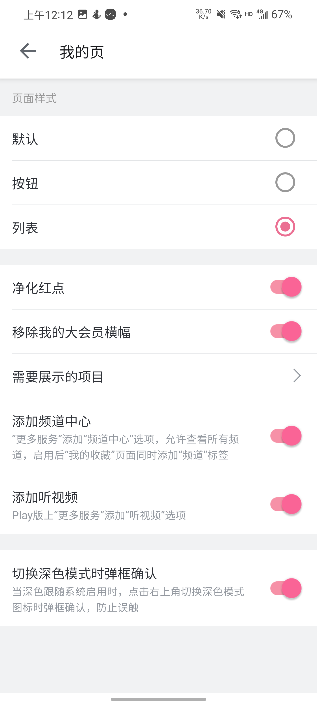
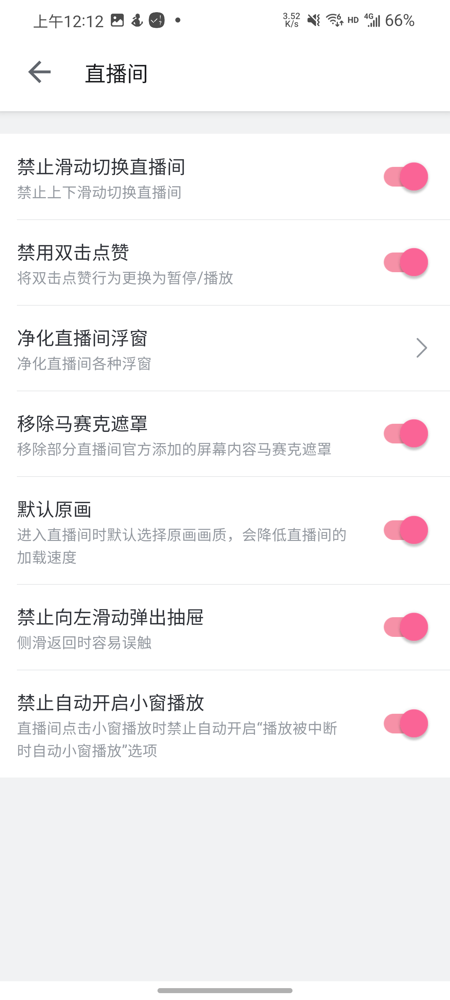
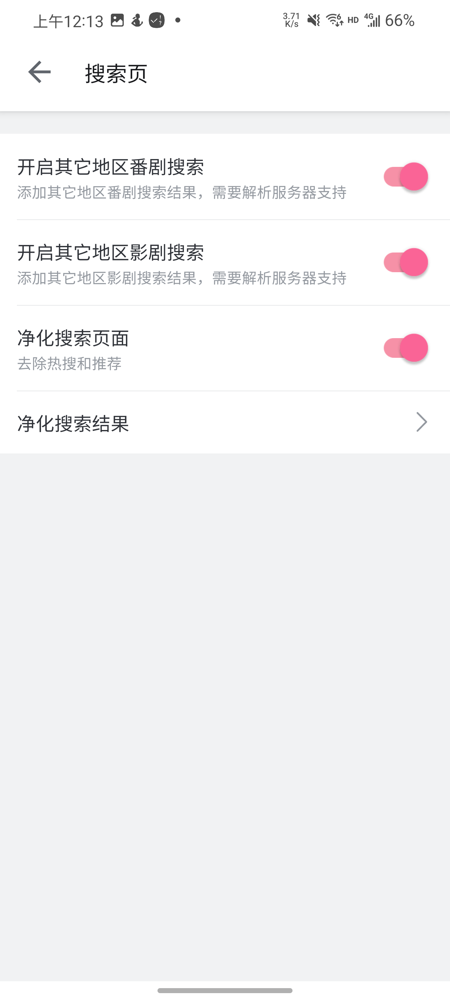
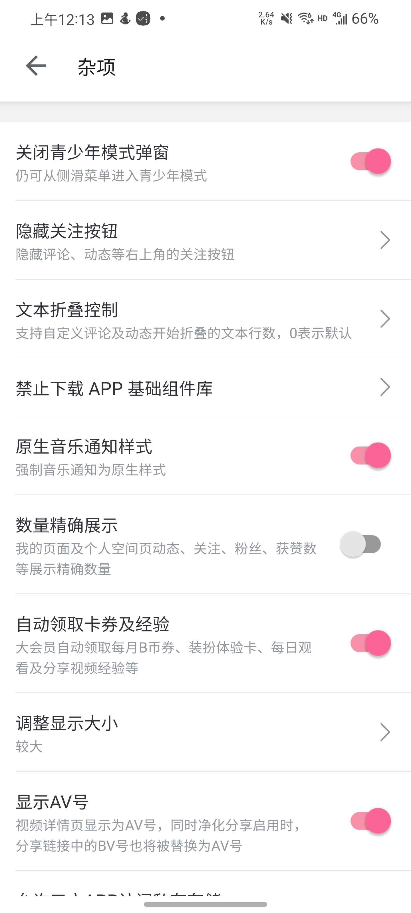

<div align="center">

# 哔哩漫游X

[](https://github.com/BiliRoamingX/BiliRoamingX/actions)
[](https://t.me/bb_show)
[![Download](https://img.shields.io/github/downloads/BiliRoamingX/BiliRoamingX-PreBuilds/total?color=critical&label=Download&logo=data:image/png;base64,iVBORw0KGgoAAAANSUhEUgAAABwAAAAcCAYAAAByDd+UAAAF2UlEQVRIiaVWS2xTRxQ9d2bs5y+O4zgEYkgoShcESIG2EQJRREFAKmABRFCpbOiioumqrNiQCmjFiiB1Q6kqwR6k0NIKUBdFLBAt31BBoUqC8xEhgXwcO7bfezPVTJyQkBA+vdKT5fdm7rn3zL3nDilMtlt1dRiOx+G3bSjO4TIGSLkOrrtJMfYBgEoA0cKmAVKqHUR/EXBBSnmJ53JQHg9UIIDA06dY3NwMmoAgMI2NLZDAXuW6XwGogQaeahHFWIUCPiKlvgZjLVKI7wn4gdSLqYzaFC96oSJ612HsiqvUjwZsJlMKE5wvkV7vCVeIq4poEU0I/jlgKATzhMOAEADRZunx3FVEq15c/DpmwIlq80LcsYGthhnLArxe85DasMFEqT/0BAIb7oVCFy3GQFK+Bdxzk4xB2jbmSVkXFOI3WWBBdEmpKYRDNK8rGr3Iddr5vHk3TjPnsAcH4aTTsEpKwDwenQVkLodcXx9EOAzPrFlQrju+h7suyONBq8/366yBgYWW67YaSnuKi/EkGkVnWdkvOifvRDAiEGPIJJPwRqMoWbUKJISJXIMxvx+l69bBE4kg/egRSO8r7NU+NEteXbVCnBfDw+CpFPiemhpIzj8lxvZ5HGdyZoxhuK0NsdpaLG5sxNy6OqQePMBASwucTAbFK1Zg0YEDiK9ejZGuLgzcuQNvUdEkarlScBgryVhW+0godJvpKIjoWzZanZNo1FHHVq5EzdGjhkpzBsGgoU4pNUotYL4tPXIEpWvXIqMz5XzcjyoUEvd4vrOIwPyMrVZEFeqFvrGHhoyjJY2Nk4vBtk3mmr6JZ6Zt8cGD8CcSyPf3T3pPpnvUHJVOf8wcxrabs5qQmTsygv6bN1G+dSu43z9ps/D7IR3HPMLnm+yYc1Ts2oX8s2fTFS6Uz7dDuMCH42BCINvdDR4KoaqhAXO3bDHvc6kUnnZ0AJyjv70dVjhsMhzo6EDX/fsg10VxeTl8RUWILl9uisgUle6/Md9SwhVihQBRhVELzjHS3Y1AeTmqDx5EsKJifPFQMokLu3fDF4thTiyGcDxuziadTOJKQwNSnZ3YfOoUymtr4S0uNi2SevgQwfnzIXS7OM5o9SpVzj9fuvQb3Q0ymzXOlx8/bkAnWjAeR0Sf69WrCCUScHW0uuQtCyKZRM2ePajcscM41YWkqzdYWYnBlha46bQpNJOULvwxucv29qJs40b4Zs+eSj4R3tm3DyXr1yPV2mrYYEIg1daGotpaVO3fj4nirsHm19djyeHDUDq4QjIoiPegOVDbRmjBgmkPe8x0FfrmzEH28WOjMN5IBEsOHXrp+kh1tendbE/P2KsUg5SPUFAIO5OZEZAHAqbfck+eIN3aasD0mc1k4YULTTIY7fMuRkL8qXvQikTQcfnyjJu1hauqsOzYMSxrakJRzcyTS1umr8/QrRjT+nqdsWz2jEa3YjEM3LiB66dPv9JJfM0alOkp8wpLp9N42NyMoFYpzWI2e4Ypy7pMQnS4SiGeSCB58iT+aGpCX0cHpp/ZrzatP49u3cLvDQ3g/f3gWl+l7FFCXKKr9fX6z2fSsk5zIUC2ja72duRLShBMJEw1vskg1kE62SwybW3Q6htNJJB1XXhcdy9X6ie6tnOn4dj2+/9WjrNIEMHDGHLpNNLDw6as3xSQcY5wURG4ZSHrOGC53L/efL5K0yr8paWGX18+/8mAZbXpsaOVgfl8iLygo28CqgPNOQ7cYBBWMFjH9KDXzT9SWWkW6QnwJB6va6uuPq/n4v+9YuhRZ+dyqLSsbdFY7NzYZJlyL729bduWodLSZjEyQm9ziRrL0A4EEO7t3b7s3LmzBR0136ZcE0U2+zPL55cCuIa3gCxcLW5wovc452ehM9PirX9ddyqg1NNayrtcqVqu1BcA7r0OSCG4f8hxvmSOs4KA29O11bQ377HMSKkTRHRCEW0iKTcpovcBzNMyWVipdbiTue51kvICgPPm5F/GDID/AISQbRffDZUGAAAAAElFTkSuQmCC)](https://github.com/BiliRoamingX/BiliRoamingX/releases/latest)
[![Star](https://img.shields.io/github/stars/BiliRoamingX/BiliRoamingX?label=Star&color=important&logo=data:image/png;base64,iVBORw0KGgoAAAANSUhEUgAAABwAAAAdCAYAAAC5UQwxAAADKUlEQVRIib2WX0iTURTAz737tpWEissM6c9cOUUkCqmHpYEtfAiFyl4yCoQefOmhHozAECGweskMw+hRitRQsD8ULSl0H1mUIDRr5myVpgvJQvP7f+P7Nsfc9s3dMTpw4ePee87vnHvvOeeD/y2IEEKNFOYHMom8lGHedGKWVjcloDJu7QLxRz7exTtpdRlqmurlot+KAHAqutRKsu/YeaQABgIge/e30upTR2hY6K8FEzhADfE3q9DqU0Uo+uoaQFCpQU01UmXS2UJjg+7RjCI3EHBoQFUIABFhGO0lFcmaSDpC6cuZ01p0kZcQilL21TQmayfpCMkoGkIA5TEuKlqkLL/dVWG2ONe80xggH7iXj4XPdiz5rUicKgDBZ8OC36Y+EsDggGj/1HlZ+2KJectXhSnwEaN1Ckw2n8zs8JrzTn1ftZ2bbjeb5i42gwHKkLy0QVNWwBE2hiNGIlEixopTGFjtvg0Zf4kEb+W8C1e1CCVP2XXm1/t9kAGO1NI5gajwJWBJVqEXlXrrNfNMybtzYu6RXuCBTTMOgAOW5FYOqjCIfKVGe3+baDnaC8tphC4Dq+Q4Xcg+eGllatUBGgv72kRLbXdaoBrskAvbXc2R0zE3Zix80C5Zjgeh9I0kAlb1DNufN0cv6eahOFnXYFzoPgmMUk4FE9Gwkl39EO8cuBZvOWHiK2NZj7H053C4lK0lMgDBxpdot1CptzNhEmCymKnlYrKiWiNiwg6kC+R/9uWAqGCqvEQASAIszHYWUwOx4CkNVxwaIeBAwoSdGogEb6wSClUOtWvwoe/oI1cbszBeqmdX97yR4C2KcYcL1kcpt/4O4PUcE7h1VqudplBJDDmAhU9F9EDxY3EYKGiFmZWzK11SXlOLOftgsA1t67gvT9Q0GhYeaUcJ5tDfgOS36tkFNS3iDWUUhsgbIOQ1uGXPnhtcoGej3l5u/sk6yeNoJSPgJiNAyDtwc/MvcLy98Q3MdJSQIXArY9YubqbTrgeKHnzgbr78oeQ2eQVu8VtTVbw9cRNfnL58APFzmxnbzR7do0kg4lRjNWGwZNp65Wkq+ukTAPgHIIGzcZjmG+EAAAAASUVORK5CYII=)](https://github.com/BiliRoamingX/BiliRoamingX)

</div>

基于 ReVanced 实现的B站 Android 客户端增强模块。模块设置完美融入 APP 设置，功能丰富，自定义程度高。
得益于实现方式，对 APP 性能几乎没有影响，流畅、迅速、启动快。支持粉版、Play 版及 HD 版。

## 📖 主要功能

- 解除番剧区域限制
- 自由移除页面组件
- 自定义直播、视频默认清晰度
- 自定义播放速度
- 字幕样式调整，翻译、保存及导入
- 调整 APP 显示大小
- 自由复制评论及视频信息
- 双指缩放视频填充屏幕
- 调用外部下载器保存视频
- 加回频道功能
- 自动领取B币券
- 分享链接净化
- 推荐、热门、动态过滤
- 开屏页背景色跟随深色模式
- 更多功能见下图

## 📱 功能截图
<div align="center">
<div>









</div>
</div>

## 💻 源码构建

```shell
git clone --recurse-submodules https://github.com/BiliRoamingX/BiliRoamingX.git
cd BiliRoamingX
./gradlew dist
```
- Windows 系统上使用 `gradlew.bat` 命令而不是 `./gradlew`
- 构建产物在 `build` 目录下

## ⬇️ 下载使用

- 前往 [BiliRoamingX-PreBuilds Release](https://github.com/BiliRoamingX/BiliRoamingX-PreBuilds/releases/latest) 下载
- 参照 [revanced-cli](https://github.com/ReVanced/revanced-cli/tree/main/docs) 文档打包
  1. 下载定制版 [revanced-cli.jar](https://github.com/zjns/revanced-cli/releases/latest)
  2. 从 [releases](https://github.com/BiliRoamingX/BiliRoamingX/releases/latest) 下载 `integrations.apk` 和 `patches.jar`
  3. 执行终端命令 `java -jar revanced-cli.jar patch --merge integrations.apk --patch-bundle patches.jar --signing-levels 1,2,3 bilibili.apk`

## ⭐ Star History

[](https://star-history.com/#BiliRoamingX/BiliRoamingX&Timeline)

## 📃 Licence

[](https://github.com/BiliRoamingX/BiliRoamingX/blob/main/LICENSE)

<div align="right">
<table><td>
<a href="#start-of-content">👆 回到顶部</a>
</td></table>
</div>
